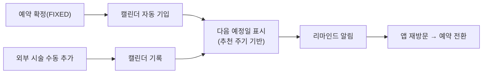
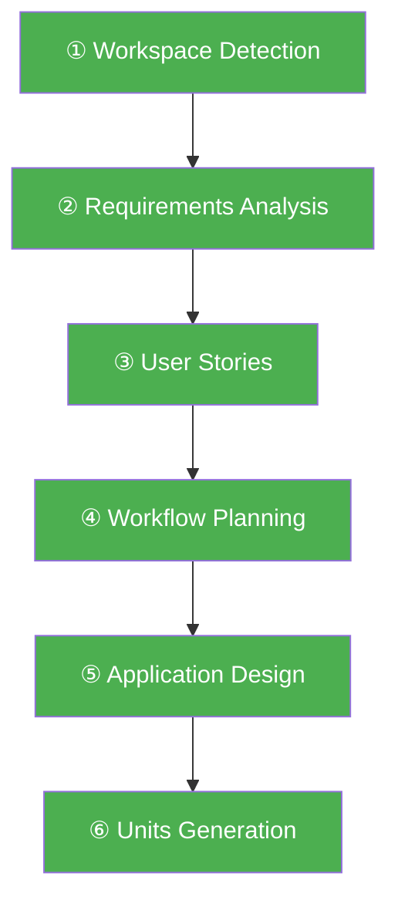
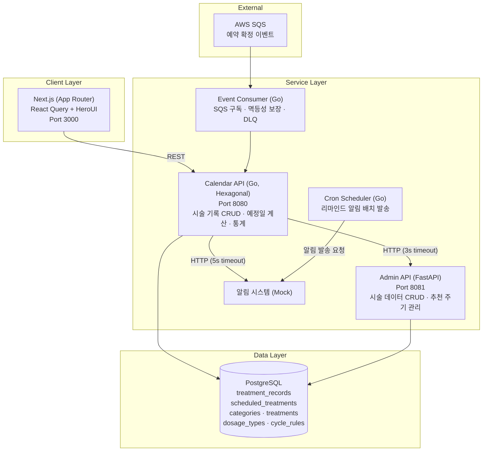

# 시술 관리 캘린더 (Treatment Calendar)

> 강남언니 앱 내 시술 이력 관리 + 추천 주기 리마인드 서비스

시술을 받은 이후의 여정을 책임지는 캘린더. 예약 확정된 시술을 자동으로 기록하고, 추천 주기에 맞춰 다음 시술 시기를 알려줍니다.

---

## 1. 제품 소개

### 시장 배경

한국은 인구 1,000명당 13.5건의 미용 시술이 이루어지는 세계 1위 시장입니다.

| 지표 | 수치 | 출처 |
|------|------|------|
| 한국 미용의료 시장 규모 (2024) | $2.79B | Data Bridge Market Research |
| 2032년 전망 | $10B (CAGR 17.3%) | Data Bridge Market Research |
| 비침습 시술 시장 성장률 | CAGR 18.7% (2024-2030) | Grand View Research |
| 전세계 시술 건수 (2023) | 3,490만 건 (+3.4% YoY) | ISAPS Global Survey 2023 |
| 한국 성형외과 시장 (2025) | $1.8B → $4.0B by 2034 | IMARC Group |

비침습 시술(보톡스, 필러, 레이저)은 3~6개월 주기로 반복하는 특성이 있습니다. 시장이 빠르게 성장하면서 **반복 시술을 관리하는 도구에 대한 수요**도 함께 커지고 있습니다.

### 문제 정의

강남언니는 시술 탐색 → 예약 → 결제까지의 여정을 지원하지만, **시술 완료 이후의 여정에는 관여하지 못하고 있습니다.**

기존 시장의 모든 플레이어(강남언니, 바비톡, 여신티켓 등)는 "시술 전" 여정(탐색·비교·예약)에 집중합니다. 그러나 비침습 시술의 본질은 **반복**입니다. 보톡스 3개월, 필러 6~12개월, 레이저 토닝 2~4주 — 한 번 받고 끝나는 것이 아니라 주기적으로 돌아오는 소비입니다. **"시술 후" 여정을 소유하는 플레이어는 아직 없습니다.**

이 공백을 발견한 것이 이 프로젝트의 출발점입니다.

실제 VOC:
> "예전에 시술받은 병원과 시술 주사를 정확히 알아야하는데 예전내역이 안보여요… 2019가을이전 내역은 없는건지 아니면 최신것만보이는건지"

> "강남언니 앱 내에서 받은 시술을 주기적으로 관리하는 기능이 없어서 구글캘린더나 다른 캘린더앱을 사용하여 수기로 관리를 하고 있어요"

팀 워크샵에서 관찰된 핵심 문제:
- **시술 이력 공백** — 내원·완료 시각과 추가 구매 시술 내역이 앱에 기록되지 않음
- **주기 관리 불가** — 보톡스·레이저 리프팅 등 주기적 시술을 여러 플랫폼에서 받으면 관리 불가
- **재방문 동기 부재** — 예약·결제 완료 이후 앱을 열 이유가 없음

### 솔루션



**핵심 기능:**

| 기능 | 설명 |
|------|------|
| 시술 자동 기입 | 예약 확정 이벤트 수신 → 캘린더 자동 등록 (수술 제외) |
| 시술 수동 CRUD | 외부 시술 직접 추가 (3단계 드롭다운: 카테고리 → 시술명 → 용량) |
| 다음 시술 예정일 | 추천 주기(룰베이스) 기반 자동 계산, 점선 UI로 구분 표시 |
| 리마인드 알림 | 주기 도래 시 푸시 알림 ("보톡스 맞은 지 3개월이 됐어요") |
| 시술 통계 | 시술별 횟수 집계 (보톡스 n회, 필러 n회) |
| 구글 캘린더 연동 | 시술 일정 단건 내보내기 (OAuth) |
| 추천 주기 관리 | 관리자가 시술 카테고리별 주기 설정 (독립 서비스) |

### 비즈니스 임팩트

시술 캘린더는 **시술 완료 이후의 빈 여정을 채워** 앱 재방문 트리거를 만듭니다.

- 주기 리마인드 → 재예약 전환 (DAU 증가)
- 시술 이력 축적 → 앱 Lock-in 효과 (이탈 방지)
- **플랫폼 외부 시술 데이터 확보** → 기존에 보이지 않던 사용자 행동의 가시화
- Phase 2에서 축적된 데이터 기반 AI 개인화 추천 주기로 확장 가능

#### 외부 시술 데이터의 전략적 가치

현재 강남언니가 파악할 수 있는 데이터는 **앱 내 예약 건에 한정**됩니다. 그러나 실제 사용자의 시술 행동은 앱 밖에서도 발생합니다 — 경쟁 플랫폼(바비톡, 여신티켓), 병원 직접 연락, 지인 소개 등 **앱 외부 예약이 전체의 약 50%로 추정**됩니다.

시술 캘린더의 수동 기입 기능은 이 보이지 않던 50%를 앱 안으로 가져옵니다:

| 확보 데이터 | 활용 | 기대 효과 |
|------------|------|----------|
| 전체 시술 주기 (앱 내 + 외부) | 정확한 리마인드 타이밍 계산 | 알림 정확도 향상 → 재예약 전환율 증가 |
| 외부 시술 병원·시술 종류 | 사용자 선호 패턴 분석 | 병원 추천 정확도 향상 → 전환율 개선 |
| 사용자별 시술 포트폴리오 | 개인화 추천 모델 학습 데이터 | Phase 2 AI 추천 주기의 데이터 기반 확보 |

핵심은 **사용자가 자발적으로 외부 시술을 기록할 동기**(주기 관리, 리마인드)를 제공함으로써, 플랫폼이 자연스럽게 시장 전체의 시술 데이터를 축적하게 된다는 점입니다.

---

## 2. AI-DLC 활용

### 워크플로우 전체 흐름

AI-DLC의 Inception Phase 6단계를 모두 수행하여 설계 문서를 생성했습니다.



| 단계 | 산출물 | 핵심 내용 |
|------|--------|-----------|
| Workspace Detection | aidlc-state.md | Greenfield 판정, 프로젝트 초기 상태 기록 |
| Requirements Analysis | requirements.md | FR 9개 + NFR 4개 도출, 기술 결정 (Go/FastAPI/Next.js) |
| User Stories | stories.md, personas.md | 7 Epic / 14 Story, Given-When-Then AC |
| Workflow Planning | execution-plan.md | 전체 Construction 단계 계획, 리스크 평가 |
| Application Design | 8개 설계 문서 | 서비스별 상세 설계 (Hexagonal 구조, API 명세, 상태 전이) |
| Units Generation | units.md | 3단계 Unit 분리 (환경설정 → 인터페이스 → 병렬 개발) |

### 단계별 정합성 체크

각 단계의 산출물이 이전 단계와 일관성을 유지하도록 **cross-reference 검증**을 수행했습니다.

```
Requirements (FR-1~9)
    ↓ 매핑 검증
User Stories (Epic 1~7, 14 Stories)
    ↓ 커버리지 검증
Application Design (컴포넌트 메서드)
    ↓ 구현 가능성 검증
Units Generation (작업 단위)
```

구체적으로:
- **Requirements → Stories**: 모든 FR이 최소 1개 이상의 Story로 커버되는지 확인
- **Stories → Application Design**: 각 Story의 AC가 컴포넌트 메서드로 구현 가능한지 검증
- **Application Design → Units**: 모든 컴포넌트가 Unit에 배정되었는지 확인

### Application Design의 세밀한 설계

AIDLC의 Application Design은 보통 컴포넌트 목록과 의존성 정도를 정의하는 수준에서 끝나기 쉽습니다. 이 프로젝트에서는 한 단계 더 들어가 **각 기능 요구사항(FR)에 대해 컴포넌트 간 호출 흐름, 에러 처리, 상태 전이까지 모두 명시**했습니다.

예시 — FR-1 (시술 자동 기입) 설계:
```
Event Consumer
  → SQS 메시지 수신
  → 멱등성 키 검증 (reservation_id 기반)
  → 수술/시술 분류 (surgery 이면 SKIP)
  → TreatmentRecord 생성
  → Admin API 호출 → CycleRule 조회
  → ScheduledTreatment 생성 (다음 예정일)
  → ACK (성공) / DLQ (3회 실패)
```

이 수준의 설계가 있으면 코드 생성 시 AI가 "무엇을 만들지"뿐 아니라 "어떤 순서로, 어떤 예외를 처리하며 만들지"까지 정확히 따릅니다. 설계 문서 8개, 총 80KB 분량의 상세 설계가 Construction 단계의 품질을 결정했습니다.

### Steering을 통한 정합성 보장 시스템

Inception에서 생성된 설계 문서의 의도가 Construction(코드 생성) 단계에서 훼손되지 않도록 **Steering 규칙**을 두었습니다.

```
.kiro/steering/
└── aws-aidlc-rules/
    └── core-workflow.md    ← AIDLC 워크플로우 전체 제어
```

Steering 생성 전략:
1. **기술스택별 Steering 생성 시 Inception 문서를 참조**하도록 규칙화
   - Go 서비스 steering → `application-design/calendar-service.md` 참조
   - Frontend steering → `application-design/web-frontend.md` 참조
   - FastAPI steering → `application-design/admin-service.md` 참조
2. **각 기술스택의 Best Practice도 함께 참조**하여 설계 의도 + 기술 품질을 동시에 확보
3. 이를 통해 AI가 코드를 생성할 때 **설계 문서에서 벗어나는 것을 시스템적으로 방지**

이 구조의 핵심은 "사람이 매번 확인하지 않아도, Steering이 설계 정합성을 자동으로 강제한다"는 점입니다.

### 단계간 정합성 보장의 전체 그림

```
Inception 산출물 (설계 의도)
    ↓ Steering이 참조하도록 규칙화
Construction (코드 생성)
    ↓ Playwright MCP로 검증
E2E 테스트 (기능 요구사항 충족 확인)
```

정합성을 **3중으로 보장**합니다:
1. **설계 시점** — 각 Inception 단계에서 이전 단계와 cross-reference 검증
2. **생성 시점** — Steering이 AI의 코드 생성을 설계 문서 범위 내로 제한
3. **검증 시점** — Playwright E2E가 유저 스토리 AC 기준으로 기능 동작을 확인

---

## 3. 기술 아키텍처

### 시스템 구성



### 핵심 설계 결정

| 결정 | 근거 |
|------|------|
| **Hexagonal Architecture** | 외부 의존성(SQS, 알림, Admin API)을 Port/Adapter로 분리 → 테스트 격리, 모킹 용이 |
| **Event Consumer 별도 프로세스** | API 서버와 독립 스케일링, 장애 격리, SQS 메시지 보존으로 복구 용이 |
| **Go 모듈 코드베이스 공유** | Calendar API + Event Consumer가 동일 도메인 로직 재사용 |
| **예정일 별도 테이블** | 조회 성능 최적화, 리마인드 배치 쿼리 단순화 |
| **Circuit Breaker** | Admin API 장애 시 Calendar API graceful degradation |
| **멱등성 (Event Consumer)** | 중복 이벤트 안전 처리, DLQ로 파싱 불가 메시지 격리 |

### AWS 서비스 활용

| 서비스 | 용도 |
|--------|------|
| **SQS/SNS** | 예약 확정 이벤트 구독 (프로덕션) |
| **RDS (PostgreSQL)** | 데이터 저장소 |
| **ECS** | 컨테이너 기반 서비스 배포 |
| **CloudWatch** | 모니터링, 알림 |

### 확장성 설계

Phase 2 (AI 추천 주기) 확장을 고려한 설계:
- 추천 주기 로직이 Admin API에 격리되어 있어, 룰베이스 → AI/LLM 교체 시 Calendar Service 변경 불필요
- 이벤트 기반 아키텍처로 새로운 Consumer 추가 용이
- 캘린더 데이터 축적 → 개인화 모델 학습 데이터로 활용 가능

---

## 4. 개발 프로세스 & 품질

### 와이어프레임 Agent

디자이너의 의도를 정확히 반영하기 위해 **와이어프레임을 생성하는 전용 Agent**를 구축했습니다.

- 와이어프레임 HTML을 생성하는 Agent를 만들어 UI 시안을 빠르게 프로토타이핑
- 생성된 스크린샷을 기준으로 레이아웃을 잡아 **디자이너의 의도에 맞는 구현**을 보장
- PRD에 포함된 와이어프레임 시안과 실제 구현 간의 갭을 최소화

### Playwright MCP 기반 E2E 테스트

각 기능 요구사항의 충족 여부를 **Playwright MCP를 통해 자동 검증**합니다.

- 모든 유저 스토리의 Acceptance Criteria를 E2E 테스트로 커버
- 기능 요구사항 충족에 대한 안정성 확보
- 향후 유지보수 시에도 기존 기능의 regression을 자동 감지

### 테스트 전략

| 레벨 | 방식 | 대상 |
|------|------|------|
| 단위 테스트 | Classicist (실제 객체 우선) | 도메인 로직, 핸들러 |
| Property-Based Testing | 순수 함수 대상 | 주기 계산, 날짜 연산 |
| 통합 테스트 | 실제 DB 사용 | Repository, API 엔드포인트 |
| E2E 테스트 | Playwright MCP | 유저 스토리 AC 검증 |

외부 의존성(이벤트, 알림, Admin API)만 모킹하고, 내부 로직은 실제 객체를 사용하는 Classicist 방식을 채택했습니다.

### 운영 안정성

| 패턴 | 적용 위치 | 효과 |
|------|-----------|------|
| Circuit Breaker | Calendar API → Admin API 호출 | Admin API 장애 시 graceful degradation |
| 멱등성 | Event Consumer | 중복 이벤트 안전 처리 |
| DLQ (Dead Letter Queue) | SQS Consumer | 파싱 불가 메시지 격리, 수동 재처리 |
| Retry (3회) | Event Consumer | 일시적 장애 자동 복구 |
| Timeout | 서비스 간 HTTP 호출 | Admin API 3s, 알림 5s — 무한 대기 방지 |

### 장애 대응 매트릭스

| 장애 상황 | 시스템 동작 | 사용자 영향 |
|-----------|------------|------------|
| Admin API 다운 | 시술 기록 정상, 예정일 미생성 | 예정일 표시 안됨 (기록은 정상) |
| 알림 시스템 다운 | 배치 스킵, 다음 배치 재시도 | 리마인드 지연 |
| SQS 지연 | Event Consumer 대기 | 자동 기입 지연 |
| PostgreSQL 다운 | 전체 서비스 중단 | 서비스 이용 불가 |

---

## 5. 프로젝트 구조

```
/
├── aidlc-docs/                    # AI-DLC 산출물
│   ├── inception/
│   │   ├── requirements/          # 요구사항 (FR 9개, NFR 4개)
│   │   ├── user-stories/          # 유저 스토리 (7 Epic, 14 Stories)
│   │   ├── application-design/    # 서비스별 상세 설계 (8개 문서)
│   │   ├── plans/                 # 실행 계획
│   │   └── units-generation/      # 작업 단위 분리
│   ├── aidlc-state.md             # 워크플로우 상태 추적
│   └── audit.md                   # 전체 의사결정 감사 로그
├── docs/
│   └── PRD.md                     # 제품 요구사항 문서
├── .kiro/
│   ├── steering/                  # Steering 규칙
│   │   └── aws-aidlc-rules/
│   │       └── core-workflow.md   # AIDLC 워크플로우 제어
│   └── aws-aidlc-rule-details/    # 단계별 상세 규칙
└── README.md
```

---

## 6. 실행 방법

```bash
# 로컬 환경 구동 (Docker Compose)
docker-compose up -d

# 각 서비스 개별 실행
# Calendar API (Go)
cd calendar-service && go run cmd/api/main.go

# Admin API (FastAPI)
cd admin-service && uvicorn app.main:app --port 8081

# Frontend (Next.js)
cd web && npm run dev
```

---

## 라이선스

이 프로젝트는 AWS AI-DLC 대회 출품작입니다.
