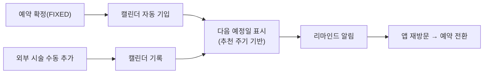
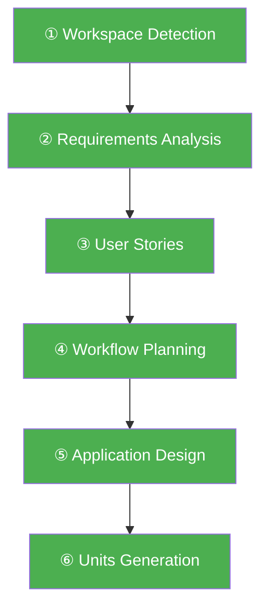
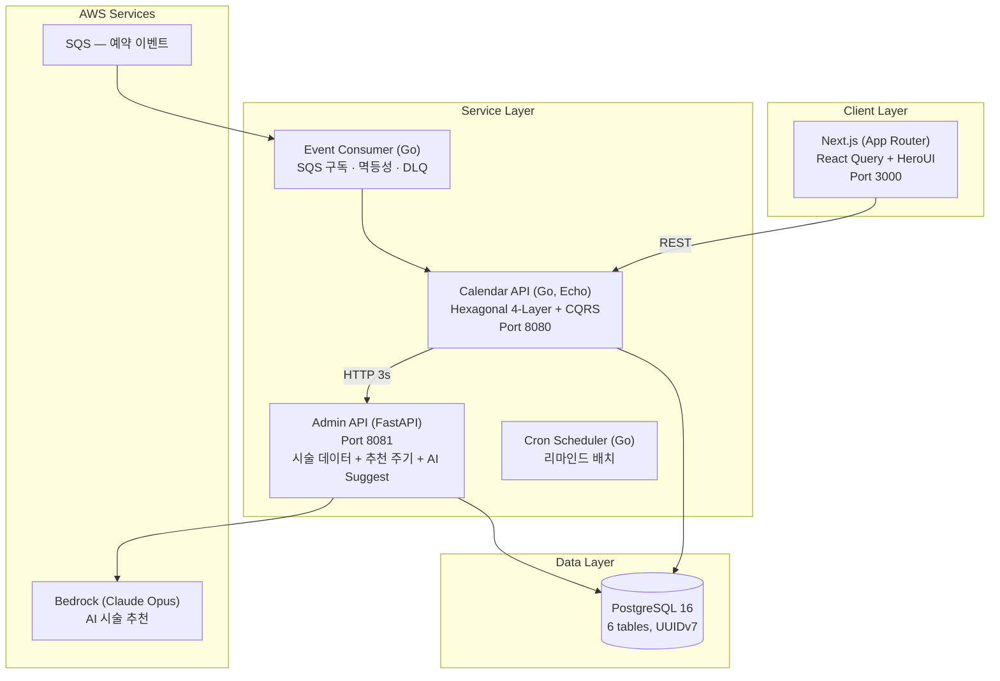

# 시술 관리 캘린더 (Treatment Calendar)

> 강남언니 앱 내 시술 이력 관리 + 추천 주기 리마인드 서비스

시술 탐색·예약·결제 이후, **아무도 소유하지 않는 "시술 후 여정"을 점유하는 최초의 제품**입니다. 예약 확정된 시술을 자동으로 기록하고, 추천 주기에 맞춰 다음 시술 시기를 알려줍니다.

---

## 1. 제품 소개

### 시장 배경

한국은 인구 1,000명당 13.5건의 미용 시술이 이루어지는 세계 1위 시장입니다.

| 지표 | 수치 | 출처 |
|------|------|------|
| 한국 미용의료 시장 규모 (2024) | $2.79B | Data Bridge Market Research |
| 2032년 전망 | $10B (CAGR 17.3%) | Data Bridge Market Research |
| 비침습 시술 시장 성장률 | CAGR 18.7% (2024-2030) | Grand View Research |
| 전세계 시술 건수 (2023) | 3,490만 건 (+3.4% YoY) | ISAPS Global Survey 2023 |
| 한국 성형외과 시장 (2025) | $1.8B → $4.0B by 2034 | IMARC Group |

비침습 시술(보톡스, 필러, 레이저)은 3~6개월 주기로 반복하는 특성이 있습니다. 시장이 빠르게 성장하면서 **반복 시술을 관리하는 도구에 대한 수요**도 함께 커지고 있습니다.

### 문제 정의

강남언니는 시술 탐색 → 예약 → 결제까지의 여정을 지원하지만, **시술 완료 이후의 여정에는 관여하지 못하고 있습니다.**

기존 시장의 모든 플레이어(강남언니, 바비톡, 여신티켓 등)는 "시술 전" 여정(탐색·비교·예약)에 집중합니다. 그러나 비침습 시술의 본질은 **반복**입니다. 보톡스 3개월, 필러 6~12개월, 레이저 토닝 2~4주 — 한 번 받고 끝나는 것이 아니라 주기적으로 돌아오는 소비입니다. **"시술 후" 여정을 소유하는 플레이어는 아직 없습니다.**

이 공백을 발견한 것이 이 프로젝트의 출발점입니다.

실제 VOC:
> "예전에 시술받은 병원과 시술 주사를 정확히 알아야하는데 예전내역이 안보여요… 2019가을이전 내역은 없는건지 아니면 최신것만보이는건지"

> "강남언니 앱 내에서 받은 시술을 주기적으로 관리하는 기능이 없어서 구글캘린더나 다른 캘린더앱을 사용하여 수기로 관리를 하고 있어요"

팀 워크샵에서 관찰된 핵심 문제:
- **시술 이력 공백** — 내원·완료 시각과 추가 구매 시술 내역이 앱에 기록되지 않음
- **주기 관리 불가** — 보톡스·레이저 리프팅 등 주기적 시술을 여러 플랫폼에서 받으면 관리 불가
- **재방문 동기 부재** — 예약·결제 완료 이후 앱을 열 이유가 없음

### 솔루션



**핵심 기능:**

| 기능 | 설명 |
|------|------|
| 시술 자동 기입 | 예약 확정 이벤트 수신 → 캘린더 자동 등록 (수술 제외) |
| 시술 수동 CRUD | 외부 시술 직접 추가 (3단계 드롭다운: 카테고리 → 시술명 → 용량) |
| 다음 시술 예정일 | 추천 주기(룰베이스) 기반 자동 계산, 점선 UI로 구분 표시 |
| 리마인드 알림 | 주기 도래 시 푸시 알림 ("보톡스 맞은 지 3개월이 됐어요") |
| 시술 통계 | 시술별 횟수 집계 (보톡스 n회, 필러 n회) |
| 구글 캘린더 연동 | 시술 일정 단건 내보내기 (OAuth) |
| 추천 주기 관리 | 관리자가 시술 카테고리별 주기 설정 (독립 서비스) |

### 비즈니스 임팩트

시술 캘린더는 **시술 완료 이후의 빈 여정을 채워** 앱 재방문 트리거를 만듭니다.

- 주기 리마인드 → 재예약 전환 (DAU 증가)
- 시술 이력 축적 → 앱 Lock-in 효과 (이탈 방지)
- **플랫폼 외부 시술 데이터 확보** → 기존에 보이지 않던 사용자 행동의 가시화
- Phase 2에서 축적된 데이터 기반 AI 개인화 추천 주기로 확장 가능

#### 기대 효과 (정량)

| 지표 | 현재 | 목표 | 근거 |
|------|------|------|------|
| 주기 이탈 (시기 놓쳐 미시술) | 측정 불가 | 리마인드로 이탈 구간 제거 | 적정 시기 알림 → "잊어버림" 방지 |
| 리마인드 → 재예약 전환율 | — | 10~15% | 개인화 리마인드 업계 벤치마크 (일반 푸시 CTR 5~7% 대비 2~3배) |
| 앱 재방문 빈도 | 예약 시에만 | 월 2~3회 | 캘린더 확인 + 예정일 알림 트리거 |
| 외부 시술 데이터 커버리지 | 0% | 점진적 확대 | 전체 시술의 약 50%가 앱 외부 발생 (추정) |

**산출 근거:** 강남언니 누적 상담 신청 670만 건 중 시술 카테고리 70%(~470만 건)가 주기성 시술. 푸시 도달율 55% 기준, 주기 리마인드 도달 시 업계 개인화 알림 전환율(10~15%) 적용. 비침습 시술 특성상 "시기를 놓쳐서 미루는" 패턴이 재예약 지연의 주요 원인이며, 리마인드가 이 병목을 직접 해소.

#### 외부 시술 데이터의 전략적 가치

현재 강남언니가 파악할 수 있는 데이터는 **앱 내 예약 건에 한정**됩니다. 그러나 실제 사용자의 시술 행동은 앱 밖에서도 발생합니다 — 경쟁 플랫폼(바비톡, 여신티켓), 병원 직접 연락, 지인 소개 등 **앱 외부 예약이 전체의 약 50%로 추정**됩니다.

시술 캘린더의 수동 기입 기능은 이 보이지 않던 50%를 앱 안으로 가져옵니다:

| 확보 데이터 | 활용 | 기대 효과 |
|------------|------|----------|
| 전체 시술 주기 (앱 내 + 외부) | 정확한 리마인드 타이밍 계산 | 알림 정확도 향상 → 재예약 전환율 증가 |
| 외부 시술 병원·시술 종류 | 사용자 선호 패턴 분석 | 병원 추천 정확도 향상 → 전환율 개선 |
| 사용자별 시술 포트폴리오 | 개인화 추천 모델 학습 데이터 | Phase 2 AI 추천 주기의 데이터 기반 확보 |

핵심은 **사용자가 자발적으로 외부 시술을 기록할 동기**(주기 관리, 리마인드)를 제공함으로써, 플랫폼이 자연스럽게 시장 전체의 시술 데이터를 축적하게 된다는 점입니다.

---

## 2. AI-DLC 활용

### 워크플로우 전체 흐름

AI-DLC의 Inception Phase 6단계를 모두 수행하여 설계 문서를 생성했습니다.



| 단계 | 산출물 | 핵심 내용 |
|------|--------|-----------|
| Workspace Detection | aidlc-state.md | Greenfield 판정, 프로젝트 초기 상태 기록 |
| Requirements Analysis | requirements.md | FR 9개 + NFR 4개 도출, 기술 결정 (Go/FastAPI/Next.js) |
| User Stories | stories.md, personas.md | 7 Epic / 14 Story, Given-When-Then AC |
| Workflow Planning | execution-plan.md | 전체 Construction 단계 계획, 리스크 평가 |
| Application Design | 8개 설계 문서 | 서비스별 상세 설계 (Hexagonal 구조, API 명세, 상태 전이) |
| Units Generation | units.md | 3단계 Unit 분리 (환경설정 → 인터페이스 → 병렬 개발) |


### 단계별 정합성 체크

각 단계의 산출물이 이전 단계와 일관성을 유지하도록 **cross-reference 검증**을 수행했습니다.

```
Requirements (FR-1~9)
    ↓ 매핑 검증
User Stories (Epic 1~7, 14 Stories)
    ↓ 커버리지 검증
Application Design (컴포넌트 메서드)
    ↓ 구현 가능성 검증
Units Generation (작업 단위)
```

### Application Design의 세밀한 설계

각 기능 요구사항(FR)에 대해 **컴포넌트 간 호출 흐름, 에러 처리, 상태 전이까지 모두 명시**했습니다. 설계 문서 8개, 총 80KB 분량.

예시 — FR-1 (시술 자동 기입) 설계:
```
Event Consumer
  → SQS 메시지 수신
  → 멱등성 키 검증 (reservation_id 기반)
  → 수술/시술 분류 (surgery 이면 SKIP)
  → TreatmentRecord 생성
  → Admin API 호출 → CycleRule 조회
  → ScheduledTreatment 생성 (다음 예정일)
  → ACK (성공) / DLQ (3회 실패)
```

### Steering을 통한 정합성 보장

Inception 설계 의도가 Construction에서 훼손되지 않도록 **8개 Steering 규칙 파일**을 구성했습니다:

| Steering 파일 | 역할 |
|--------------|------|
| `product.md` | 제품 목적, 사용자, 핵심 기능 |
| `tech.md` | 기술 스택, 서비스 간 통신 |
| `structure.md` | 프로젝트 디렉토리 구조 |
| `api-standards.md` | REST API 공통 규칙 (URL, 에러 형식, CORS) |
| `testing-standards.md` | Classicist 테스트, PBT, 커버리지 기준 |
| `go-conventions.md` | Go 4-Layer Hexagonal, CQRS, Rich Domain Model |
| `python-conventions.md` | FastAPI 계층형, async, Pydantic v2 |
| `frontend-conventions.md` | Next.js App Router, HeroUI, React Query |

### Agent 활용

| Agent | 용도 |
|-------|------|
| `ai-dlc.json` | AI-DLC 워크플로우 전체 제어 — Inception→Construction 자동 진행 |
| `wireframe-generator.md` | Inception 문서 기반 HTML 와이어프레임 자동 생성 |

### 멀티 에이전트 병렬 개발

4명의 팀원이 **각자 Kiro CLI 세션**에서 동시에 작업:

```
[Go 개발자]     → Unit 3-B: Calendar Service (CQRS + Hexagonal)
[Python 개발자] → Unit 3-C: Admin Service + 시술 데이터 시딩
[Frontend 개발자] → Unit 3-A: Next.js UI 컴포넌트 + E2E 테스트
[디자이너]      → 와이어프레임 Agent로 UI 시안 생성
```

Unit 2에서 API 계약을 확정한 후, 3개 서비스를 **완전 독립적으로 병렬 개발**. Steering이 각 세션에서 동일한 설계 규칙을 강제하여 병합 시 충돌 최소화.

---

## 3. 기술 아키텍처

### 시스템 구성



### AWS 서비스 활용

| AWS 서비스 | 용도 | 선택 근거 |
|-----------|------|----------|
| **Amazon Bedrock** (Claude Opus) | 시술명 입력 시 카테고리·주기·단위 자동 추천 | 관리자 데이터 입력 효율화, 정확도 위해 Opus 선택 |
| **Amazon SQS** | 예약 확정 이벤트 비동기 구독 | 메시지 보존(4일), DLQ, 순서 보장 불필요 |
| **Amazon RDS (PostgreSQL)** | 시술 기록 + 예정일 + 마스터 데이터 | 관계형 데이터, 트랜잭션 필요 |
| **Amazon ECS** | 컨테이너 배포 (API + Consumer + Cron) | Docker 기반, 서비스별 독립 스케일링 |
| **CloudWatch** | 로그 집계 + 알림 | 구조화 로깅(slog) 연동 |

### 핵심 설계 결정

| 결정 | 근거 |
|------|------|
| Hexagonal 4-Layer + CQRS | 외부 의존성 격리, 테스트 용이, 읽기/쓰기 분리 |
| Rich Domain Model | 비즈니스 로직을 모델에 집중 (Anemic 방지) |
| Event Consumer 별도 프로세스 | API와 독립 스케일링, 장애 격리 |
| 예정일 별도 테이블 | 배치 쿼리 최적화, 상태 관리 |
| Circuit Breaker (Admin API) | 외부 서비스 장애 시 graceful degradation |
| UUIDv7 | 시간 순서 정렬 + 분산 생성 |

---

## 4. 완성도 & 품질

### 기능 동작

| 기능 | 구현 상태 | 검증 방식 |
|------|----------|----------|
| 시술 자동 기입 (이벤트 구독) | ✅ 구현 | Mock 엔드포인트 + 멱등성 테스트 |
| 시술 수동 CRUD | ✅ 구현 | 단위 테스트 + E2E (Playwright) |
| 3단계 드롭다운 (카테고리→시술→용량) | ✅ 구현 | 컴포넌트 테스트 |
| 다음 시술 예정일 계산 | ✅ 구현 | PBT (rapid) + 단위 테스트 |
| 리마인드 알림 배치 | ✅ 구현 | 핸들러 테스트 (예약 유무 분기) |
| 시술 통계 | ✅ 구현 | 쿼리 핸들러 테스트 |
| 구글 캘린더 내보내기 | ✅ 구현 | OAuth + "(예정)" prefix |
| 추천 주기 관리 (Admin) | ✅ 구현 | 통합 테스트 |
| AI 시술 추천 (Bedrock) | ✅ 구현 | Bedrock invoke 검증 |

### 테스트 전략

| 레벨 | 도구 | 대상 | 수량 |
|------|------|------|------|
| 단위 테스트 | Go `testing` | Domain Model, CQRS Handlers | 21 tests |
| Property-Based | `rapid` | CycleCalculator (날짜 연산) | 4 properties |
| 컴포넌트 테스트 | Vitest + Testing Library | React 컴포넌트 | 37 tests |
| E2E 테스트 | Playwright | 유저 스토리 AC 검증 | 1 spec |

### 운영 안정성

| 패턴 | 적용 위치 | 효과 |
|------|-----------|------|
| Circuit Breaker | Calendar → Admin API | 장애 전파 차단 |
| 멱등성 (UNIQUE INDEX) | Event Consumer | 중복 이벤트 안전 처리 |
| DLQ | SQS Consumer | 파싱 불가 메시지 격리 |
| Retry (3회, exponential) | Event Consumer | 일시 장애 자동 복구 |
| Timeout (3s/5s) | 서비스 간 HTTP | 무한 대기 방지 |
| Graceful Shutdown | Echo 서버 | 진행 중 요청 완료 후 종료 |

### 보안

- 입력값 검증: Rich Domain Model `Validate()` + Pydantic v2
- SQL Injection 방지: pgx parameterized queries + SQLAlchemy ORM
- CORS 화이트리스트 (localhost:3000만 허용)
- 민감 정보 미노출: 에러 응답에 내부 구현 정보 제외
- 환경변수 기반 시크릿 관리 (.env gitignore)

---

## 5. 프로젝트 구조

```
NextGenPlatformUnni/
├── calendar-service/         # Go — Calendar API + Event Consumer + Cron
│   ├── cmd/api/              # Echo HTTP 서버
│   ├── cmd/consumer/         # SQS Event Consumer
│   ├── cmd/cron/             # 리마인드 배치
│   ├── internal/
│   │   ├── presentation/     # HTTP Handlers, DTOs
│   │   ├── application/      # CQRS (command/, query/)
│   │   ├── domain/           # Rich Models, Services, Ports
│   │   └── infrastructure/   # PostgreSQL, HTTP Clients
│   └── migrations/           # DB 스키마
├── admin-service/            # Python — FastAPI Admin API
│   ├── app/
│   │   ├── routers/          # cycle_rules, treatment_data, ai_suggest
│   │   ├── services/         # 비즈니스 로직 + Bedrock AI
│   │   ├── repositories/     # 데이터 액세스
│   │   └── models/schemas/   # ORM + Pydantic
│   └── migrations/           # Alembic
├── web/                      # TypeScript — Next.js Frontend
│   └── src/
│       ├── app/              # App Router pages
│       ├── components/       # 21개 UI 컴포넌트
│       └── hooks/            # 12개 React Query hooks
├── docker-compose.yml        # 로컬 개발 환경
├── Taskfile.yml              # 프로젝트 명령어
├── .kiro/
│   ├── steering/             # 8개 Steering 규칙 파일
│   └── agents/               # AI-DLC + Wireframe Agent
├── aidlc-docs/               # AI-DLC 설계 산출물 (23개 문서)
└── docs/PRD.md
```

---

## 6. 실행 방법

```bash
# 전체 서비스 실행 (Docker Compose)
task up

# 헬스체크
task health

# 로그 확인
task logs

# 서비스 중지
task down

# DB 초기화
task db:reset
```

개별 실행:
```bash
# Calendar API (Go)
cd calendar-service && task run

# Admin API (FastAPI)
cd admin-service && uvicorn app.main:app --port 8081

# Frontend (Next.js)
cd web && pnpm dev
```

접속:
- Frontend: http://localhost:3000/calendar
- Calendar API: http://localhost:8080/health
- Admin API: http://localhost:8081/health

---

## 라이선스

이 프로젝트는 AWS AI-DLC 대회 출품작입니다.
