# Execution Plan — 시술 관리 캘린더

## Detailed Analysis Summary

### Change Impact Assessment
- **User-facing changes**: Yes — 캘린더 UI, 3단계 드롭다운, 통계, 알림
- **Structural changes**: Yes — 2개 독립 서비스 (Go + FastAPI)
- **Data model changes**: Yes — 시술 기록, 시술 마스터 데이터, 추천 주기 테이블
- **API changes**: Yes — 캘린더 REST API + 관리자 API
- **NFR impact**: Yes — 중규모 사용자 대응, 이벤트 기반 아키텍처

### Risk Assessment
- **Risk Level**: Medium
- **Rollback Complexity**: Easy (Greenfield, 기존 시스템 영향 없음)
- **Testing Complexity**: Moderate (외부 의존성 모킹 필요)

---

## Workflow Visualization

```mermaid
flowchart TD
    Start(["User Request"])
    
    subgraph INCEPTION["🔵 INCEPTION PHASE"]
        WD["Workspace Detection<br/><b>COMPLETED</b>"]
        RA["Requirements Analysis<br/><b>COMPLETED</b>"]
        US["User Stories<br/><b>COMPLETED</b>"]
        WP["Workflow Planning<br/><b>COMPLETED</b>"]
        AD["Application Design<br/><b>EXECUTE</b>"]
        UG["Units Generation<br/><b>EXECUTE</b>"]
    end
    
    subgraph CONSTRUCTION["🟢 CONSTRUCTION PHASE"]
        FD["Functional Design<br/><b>EXECUTE</b>"]
        NFRA["NFR Requirements<br/><b>EXECUTE</b>"]
        NFRD["NFR Design<br/><b>EXECUTE</b>"]
        ID["Infrastructure Design<br/><b>EXECUTE</b>"]
        CG["Code Generation<br/><b>EXECUTE</b>"]
        BT["Build and Test<br/><b>EXECUTE</b>"]
    end
    
    Start --> WD
    WD --> RA
    RA --> US
    US --> WP
    WP --> AD
    AD --> UG
    UG --> FD
    FD --> NFRA
    NFRA --> NFRD
    NFRD --> ID
    ID --> CG
    CG --> BT
    BT --> End(["Complete"])
    
    style WD fill:#4CAF50,stroke:#1B5E20,stroke-width:3px,color:#fff
    style RA fill:#4CAF50,stroke:#1B5E20,stroke-width:3px,color:#fff
    style US fill:#4CAF50,stroke:#1B5E20,stroke-width:3px,color:#fff
    style WP fill:#4CAF50,stroke:#1B5E20,stroke-width:3px,color:#fff
    style AD fill:#FFA726,stroke:#E65100,stroke-width:3px,stroke-dasharray: 5 5,color:#000
    style UG fill:#FFA726,stroke:#E65100,stroke-width:3px,stroke-dasharray: 5 5,color:#000
    style FD fill:#FFA726,stroke:#E65100,stroke-width:3px,stroke-dasharray: 5 5,color:#000
    style NFRA fill:#FFA726,stroke:#E65100,stroke-width:3px,stroke-dasharray: 5 5,color:#000
    style NFRD fill:#FFA726,stroke:#E65100,stroke-width:3px,stroke-dasharray: 5 5,color:#000
    style ID fill:#FFA726,stroke:#E65100,stroke-width:3px,stroke-dasharray: 5 5,color:#000
    style CG fill:#4CAF50,stroke:#1B5E20,stroke-width:3px,color:#fff
    style BT fill:#4CAF50,stroke:#1B5E20,stroke-width:3px,color:#fff
    style INCEPTION fill:#BBDEFB,stroke:#1565C0,stroke-width:3px,color:#000
    style CONSTRUCTION fill:#C8E6C9,stroke:#2E7D32,stroke-width:3px,color:#000
    style Start fill:#CE93D8,stroke:#6A1B9A,stroke-width:3px,color:#000
    style End fill:#CE93D8,stroke:#6A1B9A,stroke-width:3px,color:#000
    linkStyle default stroke:#333,stroke-width:2px
```

---

## Phases to Execute

### 🔵 INCEPTION PHASE
- [x] Workspace Detection (COMPLETED)
- [x] Requirements Analysis (COMPLETED)
- [x] User Stories (COMPLETED)
- [x] Workflow Planning (COMPLETED)
- [ ] Application Design - **EXECUTE**
  - **Rationale**: 2개 독립 서비스 구조, 컴포넌트 간 의존성 정의 필요
- [ ] Units Generation - **EXECUTE**
  - **Rationale**: Go 캘린더 서비스 + FastAPI 관리 서비스로 분리, 단위별 구현 계획 필요

### 🟢 CONSTRUCTION PHASE (per-unit)
- [ ] Functional Design - **EXECUTE**
  - **Rationale**: 시술 데이터 모델, 주기 계산 로직, 3단계 드롭다운 필터링 등 비즈니스 로직 설계 필요
- [ ] NFR Requirements - **EXECUTE**
  - **Rationale**: 사용자 요청으로 포함. 중규모 트래픽 대응, 이벤트 기반 아키텍처, 서비스 간 통신 안정성 등 NFR 상세 분석 필요
- [ ] NFR Design - **EXECUTE**
  - **Rationale**: NFR Requirements 기반으로 구체적 패턴 설계 (캐싱, 재시도, 서킷브레이커 등)
- [ ] Infrastructure Design - **EXECUTE**
  - **Rationale**: AWS 인프라 매핑 필요 (SQS/SNS, RDS, ECS/Lambda 등)
- [ ] Code Generation - **EXECUTE** (ALWAYS)
  - **Rationale**: 구현 계획 수립 및 코드 생성
- [ ] Build and Test - **EXECUTE** (ALWAYS)
  - **Rationale**: 빌드, 테스트, 검증

### 🟡 OPERATIONS PHASE
- [ ] Operations - PLACEHOLDER

---

## Success Criteria
- **Primary Goal**: 시술 캘린더 MVP — 시술 기록/조회/예정일/알림/통계/구글캘린더 연동
- **Key Deliverables**:
  - Go 캘린더 서비스 (REST API)
  - FastAPI 관리 서비스 (시술 데이터 + 추천 주기)
  - PostgreSQL 스키마
  - 이벤트 모킹 인프라
  - 단위 테스트 + PBT
- **Quality Gates**:
  - 모든 API 엔드포인트 동작 확인
  - Classicist 단위 테스트 통과
  - 주기 계산 로직 PBT 통과
