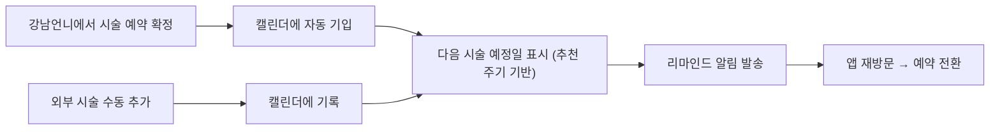

# 배경 (Background)

---

강남언니는 고객이 시술을 탐색하고 예약·결제하는 과정을 지원하지만, **시술이 완료된 이후의 여정에는 관여하지 못하고 있다.**

고객은 보톡스, 필러, 레이저 리프팅 등 주기적으로 반복해야 하는 시술을 받으면서도, 이 이력을 강남언니 앱이 아닌 개인 메모나 기억에 의존해 관리한다. 실제 VOC에서도 이 공백이 드러난다.

> "예전에 시술받은 병원과 시술 주사를 정확히 알아야하는데 예전내역이 안보여요… 2019가을이전 내역은 없는건지 아니면 최신것만보이는건지"
> 

팀 워크샵(FigJam)에서도 여러 관점에서 같은 문제가 반복 관찰됐다.

- **시술 이력 공백**: 내원·완료 시각과 병원에서 추가 구매한 시술 내역이 앱에 기록되지 않음. 고객은 개인 메모나 기억으로 관리 중
- **주기 관리 불가**: 보톡스·레이저 리프팅 등 일정 주기가 있는 시술을 여러 플랫폼에서 받으면 주기 관리가 어려움
- **재방문 동기 부재**: 예약·결제 완료 이후 고객이 강남언니를 열 이유가 없고, 다음 시술 니즈가 생겼을 때 강남언니가 먼저 떠오르지 않음

# 고객의 문제 (Problem)

---

주기적으로 시술을 받고 싶지만, 내가 받은 이력과 다음 시술 시기를 관리할 수단이 없어 개인 메모나 기억에 의존하다 주기를 놓친다.

# 해결 (Solution)

---

고객이 받은 시술을 *1) 강남언니 앱에서 기록·관리*하고, *2) 각 시술의 추천 주기에 맞춰 리마인드 알림을 받을 수 있는* **시술 캘린더**를 제공한다.

강남언니에서 예약 확정(FIXED)된 시술은 자동으로 캘린더에 기입되며, 고객은 외부에서 받은 시술도 직접 추가할 수 있다. 이를 통해 시술 이력 관리를 앱 안으로 가져오고, 주기 알림이 재방문 트리거로 작동하게 한다.

# 목표 (Goal)

---

### Phase 1 — 시술 캘린더 MVP

> **해결 문제:** 시술 이력이 앱 밖에서 관리된다 / 주기 리마인드가 없다
> 

> 강남언니 예약 확정 시술의 자동 기입과 수동 기록을 제공하고, 추천 주기 기반 리마인드 알림을 통해 재방문 트리거를 만든다.
> 

### Phase 2 — 개인화 및 확장 (mvp에서는 제외하는 기능)

> **해결 문제:** 더 정확한 시술 주기 예측 / 더 많은 유저가 캘린더를 사용하도록
> 

> 룰베이스 → AI/LLM 기반 추천 주기로 고도화, 아카이브(다회권 관리, 후기 연동) 등 확장 기능 검토
> 

# 유저스토리 (User Story)

---

### 전체 플로우

### "강남언니 앱 고객"은

**시술 기록 (자동)**

- 강남언니에서 예약 확정(FIXED)된 시술(수술 제외)은 캘린더에 자동 기입된다
- 자동 기입된 시술의 날짜를 수정하거나 삭제할 수 있다 (실제로 받지 않은 경우)
- 자동 기입된 시술의 시술명/정보를 변경할 수 있다
- 자동 기입된 예약 기록에 추가로 받은 시술을 더할 수 있다 (현장 추가 시술)

**시술 기록 (수동 CRUD)**

- 캘린더에 시술을 직접 추가할 수 있다 (시술명, 받은 날짜, 병원명, 병원 위치, 시술 의사)
- 캘린더에 기입된 시술 정보를 수정할 수 있다 (본인 캘린더에만 반영)
- 캘린더에 기입된 시술을 삭제할 수 있다 (본인 캘린더에만 반영)

**다음 시술 예정일**

- 캘린더에서 각 시술의 다음 예정일을 확인할 수 있다 (추천 주기 룰베이스 기반)
- 예정일은 점선 등 구분되는 UI로 표시된다 (확정 일정과 구분)

**리마인드 알림**

- 시술 주기가 다가오면 푸시 알림을 받을 수 있다
    - 예: "보톡스 맞은 지 3개월이 됐어요. 다음 시술을 예약해볼까요?"

**시술 통계**

- 캘린더에 등록된 시술 기준으로 받은 시술 횟수를 확인할 수 있다
    - 예: 보톡스 n회, 필러 n회

**구글 캘린더 연동**

- 특정 시술 일정을 구글 캘린더에 등록할 수 있다 (단건 내보내기)
- 다음 예정 시술이 생기면 별도로 구글 캘린더에 다시 등록할 수 있다

### "강남언니 시스템"은

- 예약 확정(FIXED) 이벤트 발생 시 해당 시술을 고객 캘린더에 자동 기입한다 (시술만, 수술 제외)
- 시술별 추천 주기(룰베이스)를 관리하고, 주기 도래 시 리마인드 알림을 발송한다

# 디자인

(와이어프레임 시안)

[시술캘린더_와이어프레임.html](attachment:21ee5ca9-41b0-4e09-b67c-980e08c2810b:시술캘린더_와이어프레임.html)

---

# Out of Scope

---

- 수술 기록 (시술만 대상)
- 아카이브 기능 (남은 시술권 관리, 후기 연동, 다회권 리마인더)
- 강남언니 외부 병원에서의 예약 정보 직접 연동
- AI/LLM 기반 추천 주기 (Phase 2)
- 구글 캘린더 → 강남언니 캘린더 역방향 동기화

# 의사결정 로그 (Design Decision Log)

---

- 1. 예약 확정(FIXED) = 시술 완료로 간주한다
    
    질문: 강남언니 예약 확정 건을 자동 기입할 때, 실제 시술 완료 여부를 별도로 확인해야 하나?
    
    결정: 예약 확정일 = 시술 완료일로 간주하고 자동 기입한다. 고객이 실제로 받지 않은 경우 날짜 수정 또는 삭제로 보정한다.
    
    근거: 실제 완료 여부를 확인하는 별도 액션을 요구하면 입력 허들이 높아진다. 예약 확정 건의 대부분은 실제로 시술이 이루어지므로, 기본값으로 완료 처리하고 예외(미방문)를 삭제로 처리하는 것이 UX상 자연스럽다.
    
- 2. 시술만 기록 대상으로 한다 (수술 제외)
    
    질문: 수술도 캘린더 기록 대상에 포함할 것인가?
    
    결정: 수술은 제외. 시술만 대상으로 한다.
    
    근거: 수술은 주기적 반복 관리의 성격이 아니며, 의료적 민감도가 높아 리마인드 알림 등의 기능과 어울리지 않는다.
    
- 3. 시술 추천 주기는 룰베이스로 시작한다
    
    질문: 시술 예정일 추천을 AI/LLM으로 할 것인가, 룰베이스로 할 것인가?
    
    결정: Phase 1은 룰베이스(시술 카테고리별 고정 주기). AI/LLM 기반 추천은 Phase 2.
    
    근거: 룰베이스만으로도 대부분의 시술에 의미 있는 주기를 제공할 수 있고, 개발 속도가 빠르다. 캘린더 데이터가 충분히 쌓인 이후 AI 고도화를 검토한다.
    
- 4. 강남언니 외부 예약 정보는 직접 연동하지 않는다
    
    질문: 고객이 다른 플랫폼이나 직접 방문으로 받은 시술도 자동 기입할 것인가?
    
    결정: 외부 연동은 Out of Scope. 수동 입력으로만 제공한다.
    
    근거: 외부 병원 예약 데이터 접근이 기술적으로 불가능하며, 수동 입력으로도 핵심 가치(이력 기록, 주기 관리)를 충분히 제공할 수 있다.
